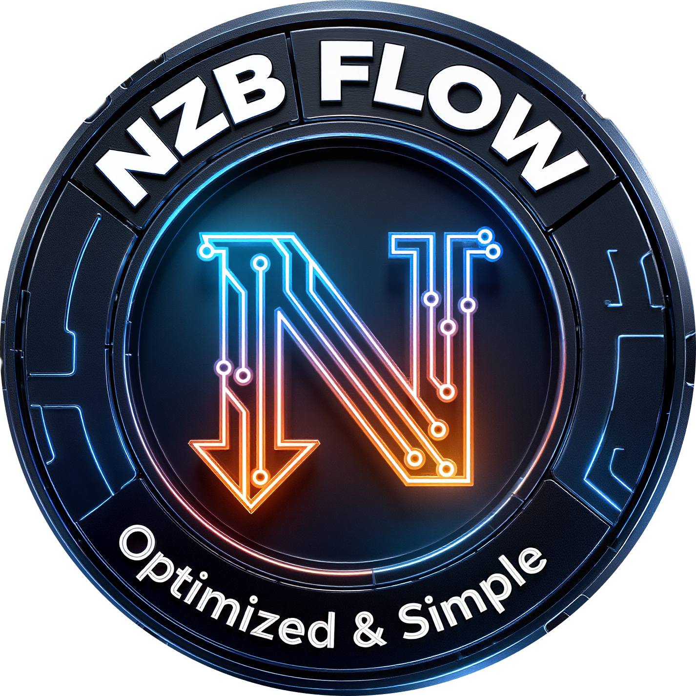
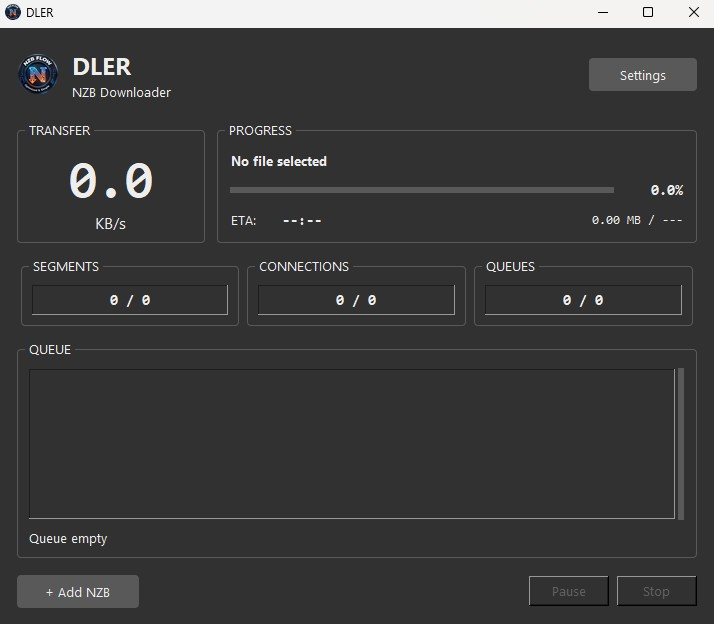

# DLER - Ultra-Fast Usenet Downloader

<div align="center">
    
</div>

High-performance NZB downloader engineered for **maximum throughput** on modern hardware. Built for users who want simplicity without sacrificing speed.

<div align="center">
    
</div>

## Why DLER?

**Different tools for different users.** While SABnzbd and NZBget excel at automation pipelines, DLER targets users who want **click-and-go simplicity**:

- Drag & drop an NZB
- Watch your file download at wire speed
- Done. No configuration rabbit holes.

## Features

### Core Engine
- **Pipelined NNTP architecture** - Up to 50+ simultaneous connections with intelligent load balancing
- **AVX2-accelerated yEnc decoding** - Native C++ SIMD decoder achieving **3+ GB/s** throughput
- **Zero-copy I/O pipeline** - Download → Decode → Write with minimal memory copies
- **Streaming PAR2 verification** - Verifies files *during* download, not after

### RAM Mode
- **Full in-memory pipeline** - Download, decode, and buffer entirely in RAM
- **GPU-accelerated repair** - Optional CUDA/CuPy support for PAR2 operations
- **Delayed disk I/O** - Only write extracted content to disk, skip intermediate files
- **Ideal for large RAM systems** - 32+ GB RAM recommended for releases up to 30 GB

### Post-Processing
- **Smart archive detection** - Analyzes NZB before download to optimize workflow
- **Direct-to-destination** - Non-archive releases download directly to final location
- **Automatic PAR2 repair** - Integrated par2j64 for data integrity
- **Nested archive handling** - Extracts complex structures (ZIP containing RAR parts)
- **Windows long path support** - Handles paths exceeding 260 characters

### User Experience
- **Real-time speed graph** - Visualize your entire download history with a smooth, anti-aliased curve
- **Live activity logs** - Color-coded feedback (connection, progress, errors)
- **Smooth progress animation** - Fluid progress bar with easing, not jerky percentage jumps
- **Modern dark theme** - Clean Tkinter interface optimized for extended use

## Technical Architecture

### Standard Mode (Disk-Based)
```
┌─────────────────────────────────────────────────────────────────┐
│                        DLER Architecture                        │
├─────────────────────────────────────────────────────────────────┤
│                                                                 │
│  ┌──────────┐    ┌──────────┐    ┌──────────┐    ┌──────────┐   │
│  │  NNTP    │───▶│  Decode  │───▶│  Write   │───▶│  Verify  │   │
│  │ Threads  │    │ Threads  │    │ Threads  │    │ (PAR2)   │   │
│  │  (50+)   │    │ (CPU//2) │    │   (8)    │    │          │   │
│  └──────────┘    └──────────┘    └──────────┘    └──────────┘   │
│       │               │               │               │         │
│       ▼               ▼               ▼               ▼         │
│  ┌─────────────────────────────────────────────────────────┐    │
│  │              Lock-Free Ring Buffers                     │    │
│  │         (Download Queue → Decode Queue → Write Queue)   │    │
│  └─────────────────────────────────────────────────────────┘    │
│                                                                 │
└─────────────────────────────────────────────────────────────────┘
```

### RAM Mode
```
┌─────────────────────────────────────────────────────────────────┐
│                      RAM Mode Pipeline                          │
├─────────────────────────────────────────────────────────────────┤
│                                                                 │
│  ┌──────────┐    ┌──────────┐    ┌──────────┐                   │
│  │  NNTP    │───▶│  Decode  │───▶│   RAM    │                   │
│  │ Download │    │  (AVX2)  │    │  Buffer  │                   │
│  │  (30+)   │    │   (24)   │    │ (BytesIO)│                   │
│  └──────────┘    └──────────┘    └──────────┘                   │
│                                        │                        │
│                  ┌─────────────────────┘                        │
│                  ▼                                              │
│  ┌──────────┐    ┌──────────┐    ┌──────────┐                   │
│  │  PAR2    │───▶│ Extract  │───▶│  Flush   │                   │
│  │  Verify  │    │   (7z)   │    │ to Disk  │                   │
│  │  (MD5)   │    │          │    │          │                   │
│  └──────────┘    └──────────┘    └──────────┘                   │
│                                                                 │
└─────────────────────────────────────────────────────────────────┘
```

### Pipeline Components

| Stage | Threads | Buffer | Technology |
|-------|---------|--------|------------|
| **Download** | 30-50 | 8 MB/conn | Async socket with SSL/TLS 1.3 |
| **Decode** | CPU cores / 2 | Ring buffer | AVX2 SIMD (3+ GB/s) or Python fallback |
| **Write** | 8-24 | 256 KB blocks | Direct I/O or RAM buffer |
| **Verify** | 1 | Streaming | par2j64 / MD5 (RAM mode) |

### SSL/TLS Implementation

```python
# Optimized for 10 Gbps throughput
- TLS 1.3 preferred (faster handshake)
- TLS 1.2 minimum (security)
- AES-256-GCM cipher (hardware accelerated)
- Session resumption enabled
- Certificate verification (CERT_REQUIRED)
```

Supports standard NNTPS ports: **563** (default), **443**

## Performance Benchmarks

| Component | Throughput | Notes |
|-----------|------------|-------|
| **yEnc Decode (AVX2)** | 3.2 GB/s | 256-bit SIMD, 32-byte alignment |
| **yEnc Decode (Python)** | 180 MB/s | NumPy-optimized fallback |
| **NNTP Download** | Line speed | Tested up to 2.5 Gbps |
| **Disk Write** | 800+ MB/s | NVMe with write-through disabled |
| **PAR2 Verify (RAM)** | ~5 GB/s | Parallel MD5 checksums |

## Download

### Choose Your Edition

| | DLER Basic | DLER Ultimate |
|---|:---:|:---:|
| **Size** | ~38 MB | ~1 GB |
| **RAM Mode** | ✅ | ✅ |
| **yEnc Decoding** | ✅ 3+ GB/s (AVX2) | ✅ 3+ GB/s (AVX2) |
| **PAR2 Verification** | ✅ CPU | ✅ CPU |
| **PAR2 GPU Repair** | ❌ | ✅ CUDA |
| **Requirements** | Any modern CPU | NVIDIA GPU + CUDA 13.x |

**Which one should I download?**

- **Basic** - You don't have an NVIDIA GPU, or want the smallest download
- **Ultimate** - You have an NVIDIA GPU and want GPU-accelerated PAR2 repair

> Both editions are functionally identical. The only difference is GPU acceleration for PAR2 repair.

### From Release (Recommended)

Download from [Releases](https://github.com/5ymph0en1x/DLER/releases):
- `DLER_v1.1.2.exe` - Ultimate edition with CUDA support
- `DLER_Basic_v1.1.2.exe` - Lightweight CPU-only edition

No installation required - standalone executables.

## Installation

### Requirements

- **OS:** Windows 10/11 (64-bit)
- **CPU:** x86-64 with AVX2 (Intel Haswell 2013+ / AMD Excavator 2015+)
- **RAM:** 2 GB minimum, 32+ GB recommended for RAM mode
- **Python:** 3.11+ (3.14 recommended)
- **GPU (Ultimate only):** NVIDIA GPU with CUDA 13.x for accelerated repair

### From Source

```bash
# Clone
git clone https://github.com/5ymph0en1x/DLER.git
cd DLER

# Install dependencies
pip install -r requirements.txt

# (Optional) Build AVX2 decoder for maximum performance
cd src/native
python setup.py build_ext --inplace
cd ../..

# (Optional) Install CuPy for GPU acceleration
pip install cupy-cuda13x

# Run
python tk_main.py
```

### Building Native Extension

For maximum yEnc decoding performance (15x faster than Python):

```bash
cd src/native
python setup.py build_ext --inplace
```

**Requirements:**
- Visual Studio 2019+ with C++ Desktop workload
- Windows SDK 10.0+
- Python development headers

The native extension uses AVX2 intrinsics for SIMD-parallel decoding:

```cpp
// Process 32 bytes per iteration
__m256i chunk = _mm256_loadu_si256(input);
__m256i decoded = _mm256_sub_epi8(chunk, offset_vec);
// ... escape sequence handling with vectorized comparisons
```

### Building Executables

DLER uses a dual-build system to generate both Basic and Ultimate editions:

```bash
# Build Basic edition (~38 MB, CPU-only)
python build_basic.py

# Build Ultimate edition (~1 GB, GPU/CUDA)
python build_ultimate.py
```

The spec file (`dler_tk.spec`) automatically detects the `DLER_BUILD` environment variable:
- `DLER_BUILD=basic` → Excludes CuPy/CUDA libraries
- `DLER_BUILD=ultimate` → Includes full CUDA support

## Configuration

### First Launch

1. Click **Settings** (gear icon)
2. Configure your Usenet provider:
   - **Host:** news.yourprovider.com
   - **Port:** 563 (SSL) or 119 (plain)
   - **SSL:** Enabled (recommended)
   - **Connections:** Start with 20, increase if stable
3. Set download and extraction directories
4. (Optional) Enable RAM mode for systems with 32+ GB RAM
5. Save

### Config File Location

```
~/.dler/config.json
```

## Project Structure

```
DLER/
├── tk_main.py                  # Entry point
├── src/
│   ├── core/
│   │   ├── fast_nntp.py        # High-perf NNTP client (SSL, pipelining)
│   │   ├── turbo_engine_v2.py  # Download orchestrator (thread pools)
│   │   ├── turbo_yenc.py       # Python yEnc decoder (NumPy)
│   │   ├── post_processor.py   # PAR2 + extraction + smart routing
│   │   └── ram_processor.py    # RAM mode pipeline (v1.1.0)
│   ├── gui/
│   │   ├── tkinter_app.py      # Main GUI application
│   │   └── speed_graph.py      # Real-time speed visualization
│   ├── utils/
│   │   └── config.py           # JSON config management
│   └── native/
│       ├── yenc_turbo.cpp      # AVX2 SIMD decoder
│       └── setup.py            # Build script
└── tools/
    ├── 7z.exe                  # 7-Zip 23.01
    ├── 7z.dll
    └── par2j64.exe             # MultiPar 1.3.2.6
```

## Troubleshooting

### Slow Speeds
1. Increase connections (Settings → Connections)
2. Check your provider's connection limit
3. Ensure SSL is enabled (some ISPs throttle plain NNTP)
4. Try port 443 if 563 is blocked

### PAR2 Repair Fails
- Insufficient parity blocks in the release
- Disk full (PAR2 needs temp space)
- Antivirus blocking par2j64.exe

### High Memory Usage
- Disable RAM mode for systems with less than 16 GB RAM
- Reduce connections (each uses ~8 MB buffer)
- Reduce decoder threads in advanced settings

### "AVX2 not available"
Your CPU doesn't support AVX2. DLER will use the Python fallback decoder (still fast, ~180 MB/s).

### "CuPy not available"
GPU acceleration requires:
- NVIDIA GPU with CUDA support
- CUDA 13.x toolkit installed
- CuPy package (`pip install cupy-cuda13x`)

DLER will fall back to CPU-based processing if CuPy is unavailable.

## Bundled Tools

| Tool | Version | License | Purpose |
|------|---------|---------|---------|
| 7-Zip | 23.01 | LGPL | Archive extraction |
| par2j64 | 1.3.2.6 | GPL | PAR2 verification/repair |

## Changelog

### v1.1.2 (2026-01-14)
- **New:** Incremental PAR2 verification - verifies files as they complete downloading
- **New:** Early damage detection - know if repair is needed before download finishes
- **New:** Per-file MD5 verification with parallel computation
- **Improved:** Post-processing pipeline optimization

### v1.1.1 (2026-01-13)
- **New:** Dual edition system (Basic ~38 MB / Ultimate ~1 GB)
- **New:** CUDA kernel warmup for reduced first-use latency
- **New:** VRAM memory management (automatic cleanup after GPU operations)
- **Fixed:** Filename artifacts `(1/0)` no longer appear in downloaded files
- **Fixed:** Multiple NZBs can now be downloaded in sequence without restart
- **Fixed:** Automatic reconnection between downloads

### v1.1.0 (2026-01-12)
- **New:** RAM mode - full in-memory download and processing pipeline
- **New:** GPU acceleration support (CuPy/CUDA)
- **New:** Windows long path support (>260 characters)
- **Fixed:** Archive detection in RAM mode
- **Fixed:** File naming with obfuscated NZBs
- **Fixed:** CuPy/NumPy compatibility with Python 3.14

### v1.0.0
- Initial release

## License

MIT License - See [LICENSE](LICENSE)

## Credits

- **Author:** Symphoenix
- **yEnc specification:** Jeremy Nixon (2001)
- **7-Zip:** Igor Pavlov
- **MultiPar:** Yutaka Sawada

## Contributing

Contributions welcome! Please:

1. Fork the repository
2. Create a feature branch (`git checkout -b feature/amazing`)
3. Commit your changes
4. Push and open a Pull Request

---

<div align="center">
    <strong>DLER v1.1.2</strong> - Download at wire speed.
</div>
