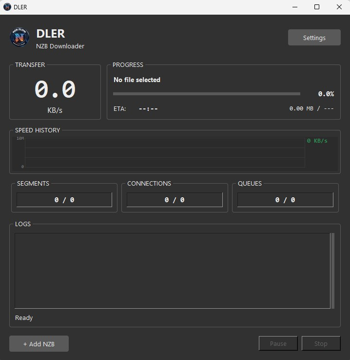
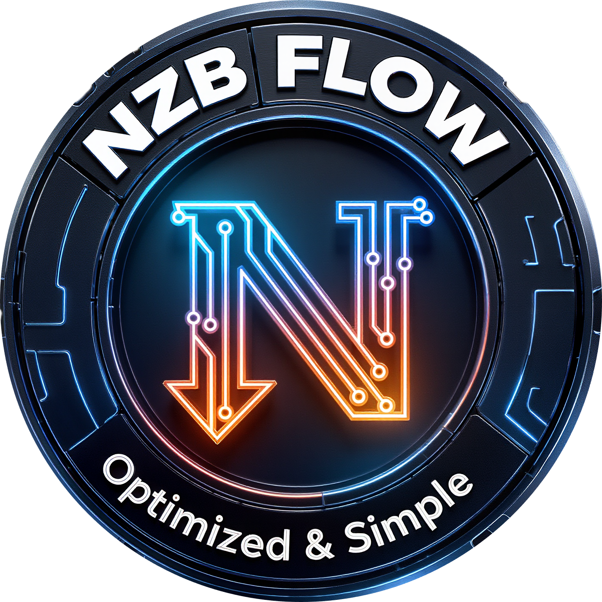

<div align="center">
    
</div>

# DLER - Ultra-Fast Usenet Downloader

High-performance NZB downloader engineered for **maximum throughput** on modern hardware and fast fiber. Built for users who want simplicity without sacrificing speed.

<div align="center">
    
</div>

## Why DLER?

**Different tools for different users.** While SABnzbd and NZBget excel at heavyweight automation pipelines, DLER targets users who want **click-and-go simplicity** that still saturates a 10 Gbps line:

- Drag & drop an NZB (or drop it in a watched folder)
- Watch it download at wire speed across multiple processes
- Done. No configuration rabbit holes.

## Features

### Core Engine
- **Multiprocess download engine** - Escapes the CPython GIL by sharding an NZB's files across worker processes. Single-process tops out at ~625 MB/s (~5 Gbps); **2-3 processes reach ~970 MB/s (~7.8 Gbps)** on a 100-connection account.
- **Pipelined NNTP architecture** - Up to 100 simultaneous connections with throughput-adaptive pipeline depth (AIMD) and a dynamic connection pool.
- **AVX2-accelerated yEnc decoding** - Native C++ SIMD decoder achieving **3+ GB/s**, with a NumPy Python fallback when AVX2 is unavailable.
- **Streaming PAR2 verification** - Verifies files *during* download, not after.

### Post-Processing
- **Smart archive detection** - Analyzes the NZB before download to pick the optimal workflow.
- **Direct-to-destination** - Non-archive releases download straight to their final location.
- **Automatic PAR2 repair** - Integrated `par2j64` for data integrity.
- **RAR / 7z / nested archives** - Extracts complex structures (ZIP containing RAR parts) via bundled `UnRAR64` and `7z`.
- **Windows long-path support** - Handles paths exceeding 260 characters.

### Automation
- **Watch folder** - Drop a `.nzb` into a watched directory and DLER auto-ingests and downloads it. Configurable surveillance interval (1-3600 s), with a stability check so partially-copied files are never picked up early.
- **Post-process script hook** - Run any command after each download. DLER exposes the full result through `DLER_*` environment variables (release, success, repaired, sizes, duration, average speed, segments, connections, processes...).
- **Telegram completion card** - Ships with `dler_telegram.ps1`: a designed dark stat-card (release, size, average speed, duration, files, connections, processes, Gbps) rendered to PNG and sent to your Telegram. No dependencies to install (uses Edge headless + curl, both bundled with Windows 11).

### User Experience
- **Responsive STOP** - A single STOP aborts *every* stage: multiprocess child downloads, the single-process engine, and in-flight post-processing (PAR2 / extraction). No "it keeps going after I hit stop."
- **Real-time speed graph** - Smooth, anti-aliased view of your entire download history.
- **Live activity logs** - Color-coded feedback (connection, progress, errors).
- **Smooth progress animation** - Eased progress bar, not jerky percentage jumps.
- **Modern dark theme** - Clean Tkinter interface (TKinterModernThemes) optimized for extended use.

## Technical Architecture

### Multiprocess Pipeline (GIL escape)
```
┌───────────────────────────────────────────────────────────────────┐
│                       DLER Multiprocess Engine                      │
├───────────────────────────────────────────────────────────────────┤
│   NZB files are bin-packed by size into N shards (N = 2-3).         │
│   The 100-connection account budget is split across the children.   │
│                                                                     │
│   ┌─ Process 1 ─────────────┐   ┌─ Process 2 ─────────────┐         │
│   │ NNTP → Decode → Write   │   │ NNTP → Decode → Write   │  ...    │
│   │  (AVX2 yEnc)            │   │  (AVX2 yEnc)            │         │
│   └────────────┬────────────┘   └────────────┬────────────┘         │
│                │  disjoint files, no cross-process byte transfer    │
│                ▼                              ▼                      │
│           Shared output dir  ──►  PAR2 verify + extract (main proc) │
└───────────────────────────────────────────────────────────────────┘
```

Each process downloads a disjoint subset of files and writes its own complete
outputs — there is **no cross-process transfer of segment bytes**, which is what
makes the approach both correct and actually faster.

### Pipeline Components

| Stage | Workers | Buffer | Technology |
|-------|---------|--------|------------|
| **Download** | up to 100 conns (split across procs) | 8 MB/conn | Async socket, SSL/TLS 1.3 |
| **Decode** | CPU cores / 2 per proc | Ring buffer | AVX2 SIMD (3+ GB/s) or Python fallback |
| **Write** | 8-24 | 256 KB blocks | Direct I/O |
| **Verify** | 1 (main proc) | Streaming | par2j64 |

### SSL/TLS Implementation
```python
# Optimized for 10 Gbps throughput
- TLS 1.3 preferred (faster handshake)
- TLS 1.2 minimum (security)
- AES-256-GCM cipher (hardware accelerated)
- Session resumption enabled (TLS tickets)
- IPv4 + IPv6 (getaddrinfo, both families)
- Throughput-adaptive pipeline depth (AIMD) + dynamic connection pool
- Certificate verification (CERT_REQUIRED)
```

Supports standard NNTPS ports: **563** (default), **443**.

## Performance

Measured against a 6.7 GB test release on a 10 Gbps fiber line :

| Configuration | Throughput | Notes |
|---------------|------------|-------|
| **Single process** | ~625 MB/s (~5 Gbps) | GIL-bound regardless of connections/pipeline depth |
| **Multiprocess (2)** | ~956 MB/s | |
| **Multiprocess (3)** | **~973 MB/s (~7.8 Gbps)** | Sweet spot |
| **Multiprocess (4+)** | ~956 MB/s and down | Oversubscription hurts |
| yEnc decode (AVX2) | 3.2 GB/s | 256-bit SIMD |
| yEnc decode (Python) | ~180 MB/s | NumPy fallback |

> The ceiling (~970 MB/s) is the provider/account aggregate
> (100 conns × ~9.7 MB/s/conn). Going faster needs more connections (capped)
> or a second provider.

## Download

Grab the latest standalone executable from [Releases](https://github.com/5ymph0en1x/DLER/releases):

- **`DLER.exe`** — single onefile, no-console build (~47 MB). No installation, no
  external dependencies — the extraction/repair tools are bundled inside.

## Installation

### Requirements

- **OS:** Windows 10/11 (64-bit)
- **CPU:** x86-64 (AVX2 recommended for the 3+ GB/s decoder; a Python fallback runs without it)
- **RAM:** 2 GB minimum
- **Python (from source):** 3.11+ (3.14 recommended)

### From Source

```bash
# Clone
git clone https://github.com/5ymph0en1x/DLER.git
cd DLER

# Install dependencies (uv recommended)
uv sync          # or: pip install -r requirements.txt

# (Optional) Build the AVX2 decoder for maximum performance
cd src/native
python setup.py build_ext --inplace
cd ../..

# Run
uv run python tk_main.py      # or: python tk_main.py
```

The `tools/` directory (par2j64, 7z, UnRAR64) is included in the repo, so a
fresh clone runs and builds with **nothing to download**.

### Building the Native Extension

For maximum yEnc decoding performance (much faster than the Python fallback):

```bash
cd src/native
python setup.py build_ext --inplace
```

**Requirements:** Visual Studio 2019+ (C++ Desktop workload), Windows SDK 10.0+,
Python development headers. The extension uses AVX2 intrinsics:

```cpp
// Process 32 bytes per iteration
__m256i chunk = _mm256_loadu_si256(input);
__m256i decoded = _mm256_sub_epi8(chunk, offset_vec);
// ... escape-sequence handling with vectorized comparisons
```

### Building the Executable

```bash
# Single onefile, no-console build -> dist/DLER.exe
uv run --with pyinstaller python build_basic.py
```

The PyInstaller spec (`dler_tk.spec`) bundles the native yEnc decoder, the
extraction/repair tools, the dark theme, and drag-and-drop support into one exe.

## Configuration

### First Launch

1. Open **Settings**.
2. Configure your Usenet provider:
   - **Host:** news.yourprovider.com
   - **Port:** 563 (SSL) or 119 (plain)
   - **SSL:** Enabled (recommended)
   - **Connections:** Set to your account's connection cap (e.g. 100).
3. Set download and extraction directories.
4. (Recommended for 10 Gbps) Enable **multiprocess** and set **`num_processes: 3`**.
5. (Optional) In the **Automation** tab, enable the watch folder and/or a post-process command.
6. Save.

> **Performance gotcha:** leave `num_processes` at `0` and DLER auto-detects
> `cpu_count` — on a 32-thread machine that means 32 processes fighting over the
> connection cap (catastrophic oversubscription). **Always set `num_processes`
> explicitly to 2 or 3.**

### Config File Location

```
~/.dler/config.json
```

### Telegram Notification (optional)

`dler_telegram.ps1` ships with placeholder credentials. To use it:

1. Open `dler_telegram.ps1` and set `$Token` and `$ChatId` to your bot token and chat id.
2. In **Settings → Automation → Post-process command**, set:
   ```
   powershell -NoProfile -ExecutionPolicy Bypass -File "C:\path\to\dler_telegram.ps1"
   ```
3. Preview without sending: `$env:DLER_TG_DRYRUN='1'; .\dler_telegram.ps1`

## Project Structure

```
DLER/
├── tk_main.py                  # Entry point (with multiprocessing.freeze_support)
├── src/
│   ├── core/
│   │   ├── fast_nntp.py        # High-perf NNTP client (SSL, pipelining)
│   │   ├── turbo_engine_v2.py  # Download orchestrator (thread pools, adaptive pipeline)
│   │   ├── mp_engine.py        # Multiprocess engine (file sharding, GIL escape)
│   │   ├── turbo_yenc.py       # Python yEnc decoder (NumPy fallback)
│   │   ├── post_processor.py   # PAR2 + extraction + smart routing
│   │   ├── ram_7z.py           # 7z.dll extraction backend (ctypes/COM)
│   │   ├── ram_rar.py          # UnRAR64.dll extraction backend (ctypes)
│   │   ├── adaptive_extractor.py # Release-type classification + extraction plan
│   │   ├── watch_folder.py     # Watch-folder auto-ingest (polling + stability check)
│   │   └── post_script.py      # Post-process command hook (DLER_* env vars)
│   ├── gui/
│   │   ├── tkinter_app.py      # Main GUI application
│   │   ├── speed_graph.py      # Real-time speed visualization
│   │   └── system_tray.py      # Optional system-tray integration
│   ├── utils/
│   │   └── config.py           # JSON config management
│   └── native/
│       ├── yenc_turbo.cpp      # AVX2 SIMD decoder source
│       └── setup.py            # Native build script
├── tools/                      # Bundled (committed) — nothing to download
│   ├── 7z.exe / 7z.dll         # 7-Zip
│   ├── par2j64.exe             # MultiPar (PAR2)
│   └── UnRAR64.dll             # UnRAR (x64)
├── dler_telegram.ps1           # Telegram completion-card hook (placeholders)
├── build_basic.py              # Build entry point
├── dler_tk.spec                # PyInstaller spec
└── tests/                      # Test suite (uv run --with pytest pytest)
```

## Troubleshooting

### Slow Speeds
1. Enable multiprocess and set `num_processes` to 2 or 3 (do **not** leave it at 0).
2. Set connections to your account's actual cap.
3. Check your provider's connection limit (exceeding it makes the server reject connections).
4. Ensure SSL is enabled (some ISPs throttle plain NNTP); try port 443 if 563 is blocked.

### Download Freezes at Start (multiprocess)
The main engine must hold **zero** connections in multiprocess mode so the child
processes own the full account budget. DLER handles this automatically; if you
see a stall, confirm `connections` does not exceed your account cap.

### PAR2 Repair Fails
- Insufficient parity blocks in the release.
- Disk full (PAR2 needs temp space).
- Antivirus blocking `par2j64.exe`.

### "AVX2 not available"
Your CPU lacks AVX2. DLER falls back to the NumPy Python decoder (still ~180 MB/s).

## Bundled Tools

All tools are committed to the repo and bundled into the exe — users never need
to download anything.

| Tool | License | Purpose |
|------|---------|---------|
| 7-Zip (`7z.exe`/`7z.dll`) | LGPL | Archive extraction |
| par2j64 (MultiPar) | GPL | PAR2 verification / repair |
| UnRAR64 | freeware (RARLAB) | RAR extraction |

## Changelog

### v2.0.0 (2026-06-23)
- **New:** Multiprocess download engine — escapes the GIL, ~970 MB/s (~7.8 Gbps) with 2-3 processes vs ~625 MB/s single-process.
- **New:** Automation tab — watch folder (auto-ingest dropped `.nzb`, configurable 1-3600 s timer) and post-process command hook with rich `DLER_*` context.
- **New:** Telegram completion-card hook (`dler_telegram.ps1`) — designed dark stat-card via Edge headless + curl.
- **Fixed:** STOP now aborts every stage — multiprocess children, single-process engine, and in-flight PAR2/extraction.
- **Removed:** RAM mode and GPU/CUDA (CuPy) processing, and the dual Basic/Ultimate editions — DLER is now a single, lean edition.
- **Improved:** Connection-budget handling in multiprocess mode (main engine holds zero connections; children own the full cap).

### v1.3.0 (2026-06-23)
- **New:** IPv4 + IPv6 dual-stack support (getaddrinfo, both families).
- **New:** Throughput-adaptive pipeline depth (AIMD) + dynamic connection pool.
- **New:** Session resumption enabled (TLS tickets).

### v1.2.x and earlier
- Multi-volume / encrypted RAR extraction fixes, incremental PAR2 verification,
  adaptive NNTP pipelining, sequential multi-NZB downloads, and the initial
  release. (See git history for full detail.)

## License

MIT License - See [LICENSE](LICENSE)

## Credits

- **Author:** Symphoenix
- **yEnc specification:** Jeremy Nixon (2001)
- **7-Zip:** Igor Pavlov
- **MultiPar:** Yutaka Sawada
- **UnRAR:** Alexander Roshal (RARLAB)

## Contributing

Contributions welcome! Please:

1. Fork the repository
2. Create a feature branch (`git checkout -b feature/amazing`)
3. Commit your changes
4. Push and open a Pull Request

---

<div align="center">
    
</div>
